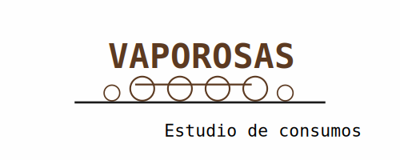

# VAPOROSAS

<p align="center">
  
</p>

**Spanish Steam Locomotives Consumption Study**

---

## 📌 Resumen | Summary

**Español:** Estudio comparativo de consumos de agua y carbón de cuatro locomotoras de vapor españolas (MZA 1701, MZA 1801, AND240-4253, RN141-2106 "Mikado") mediante simulación en Open Rails y análisis estadístico en R.

**English:** Comparative consumption study of water and coal of four Spanish steam locomotives through Open Rails simulation and statistical analysis in R.

---

## 📊 Resultados clave | Key results

| Puesto | Locomotora | Frase |
|--------|-----------|-------|
| 1º | RN141-2106 (Mikado) | Most balanced / La más equilibrada |
| 2º | MZA 1701 | Most economical / La más económica |
| 3º | AND240-4253 | Most predictable / La más predecible |
| 4º | MZA 1801 | Fastest / La más rápida |

---

## 📁 Estructura | Repository structure

```
vaporosas-consumos/
├── README.md
├── LICENSE
├── assets/
│   ├── Vaporosas.png
│   └── Vaporosas.svg
├── docs/
│   ├── es/
│   │   └── informe_ejecutivo.pdf
│   └── en/
│       └── executive_report.pdf
├── resultados/
│   ├── csv/
│   └── graficos/
│       ├── *.svg (ES)
│       └── *_en.svg (EN)
└── scripts/
    └── *.R (8 scripts)
```

## 📄 Documentación | Documentation

- **Informe ejecutivo (ES):** [`docs/es/informe_ejecutivo.pdf`](docs/es/informe_ejecutivo.pdf)
- **Executive Report (EN):** [`docs/en/executive_report.pdf`](docs/en/executive_report.pdf)

---

## 🚂 Locomotoras analizadas | Locomotives analyzed

| Nombre | Configuración | Época |
|--------|---------------|-------|
| MZA 1701 | 2-4-1 | Transición (1915) |
| MZA 1801 | 2-4-1 | Madurez vapor (1939) |
| AND240-4253 | 2-4-0 | Potencia bruta (1925) |
| RN141-2106 | 1-4-1 | Madurez vapor (1945) |

---

## 📊 Principales hallazgos | Key findings

| Categoría | Ganador | Valor |
|-----------|---------|-------|
| Water efficiency | RN141-2106 | 133.9 L/km |
| Coal efficiency | MZA 1701 | 12.3 kg/km |
| Speed | MZA 1801 | 47.8 km/h |
| Predictability | AND240-4253 | CV 34-47% |

---

## 📝 Metodología | Methodology

- **Simulación:** Open Rails con conducción manual
- **Datos:** 73 registros de consumo en 3 rutas
- **Análisis:** R (descriptivos, regresiones, comparativas)
- **Base de datos:** SQLite

---

## 📜 Licencia | License

MIT + CC BY-NC-ND

---

## 👤 Autor | Author

**Francisco Gabriel Murillo Roldán**  
Ingeniero de Minas | Mining Engineer

[](https://www.linkedin.com/in/francisco-murillo-9946a43b3/)

📅 *Junio 2026*


